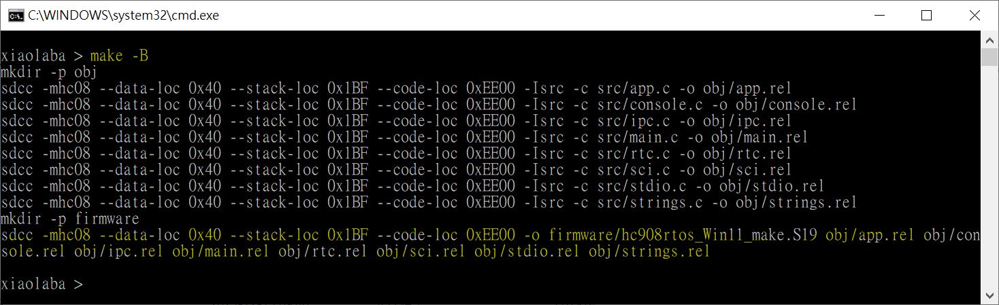
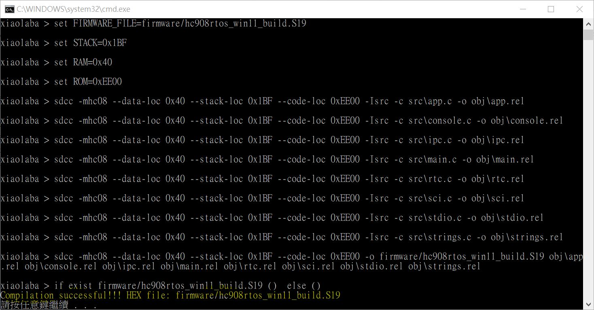
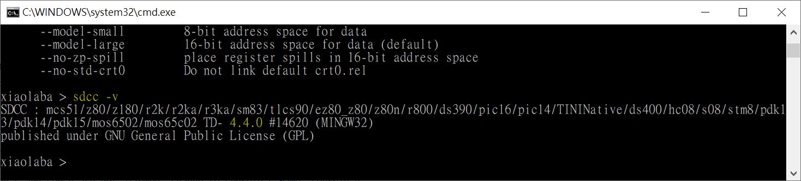

# HC08_SDCC_RTOS
copy from https://github.com/darklife/hc908rtos. no clone.

### what is done
uses win11, SDCC 4.4  
revised all fucntion() to function(void), ceased SDCC 4.4.0 compiler error  
src and firmware folder, easy user  
revised Makefile, work with SDCC 4.4.0
filenames of con.c and con.h are not allowed in Windows computer, change to console.c and console.h  

### how to build
build.bat, used to build S19 under windows PC, test ok  
Makefile, used to build S19 under windows PC, test ok  
compare_S19.bat, see two firmware built by build.bat and Makefile, test result, no diff  
clean.bat, delete temperatory folder "obj"  

### SDCC version used, firmware and result
  
  
  

